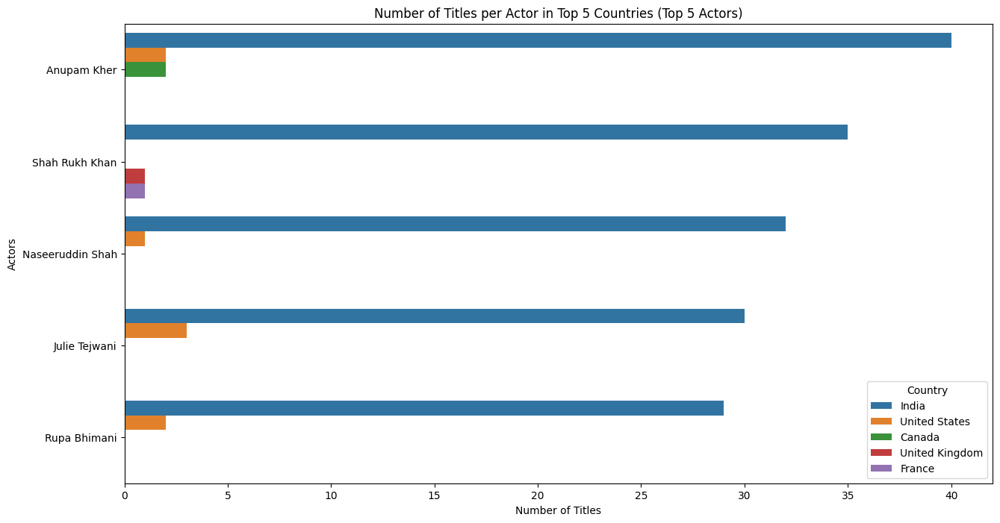
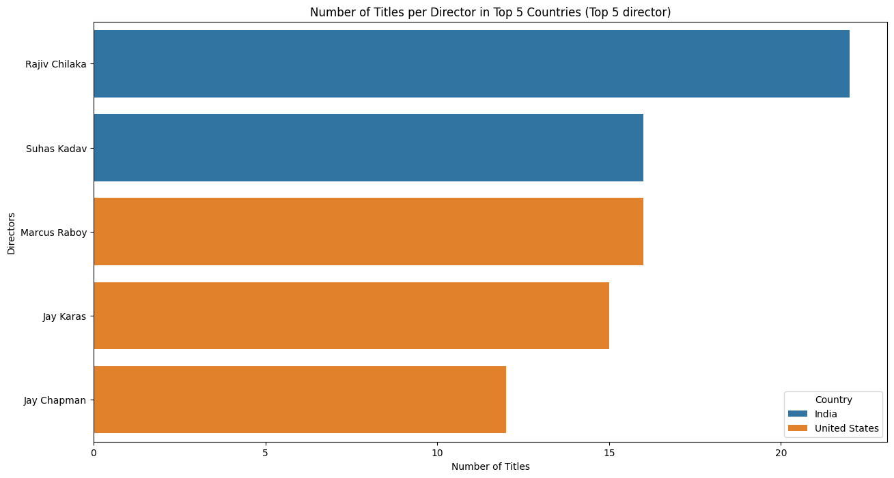
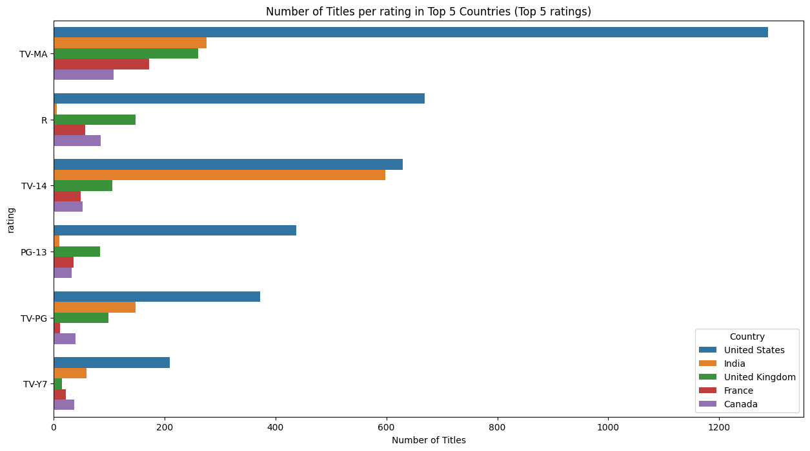
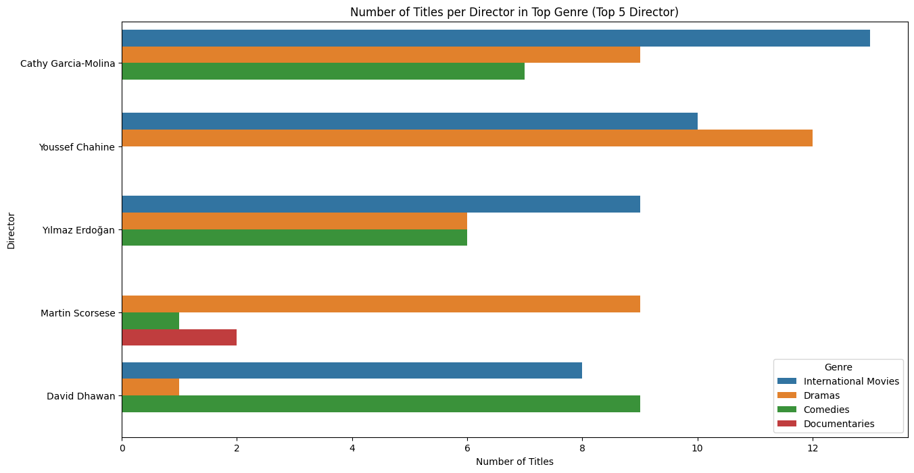
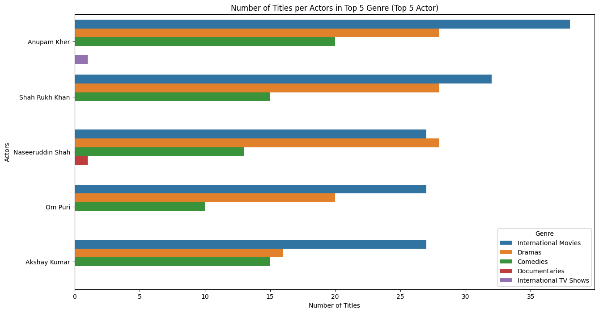
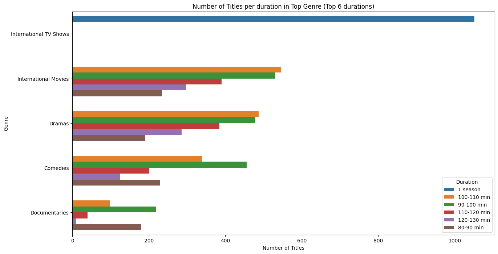
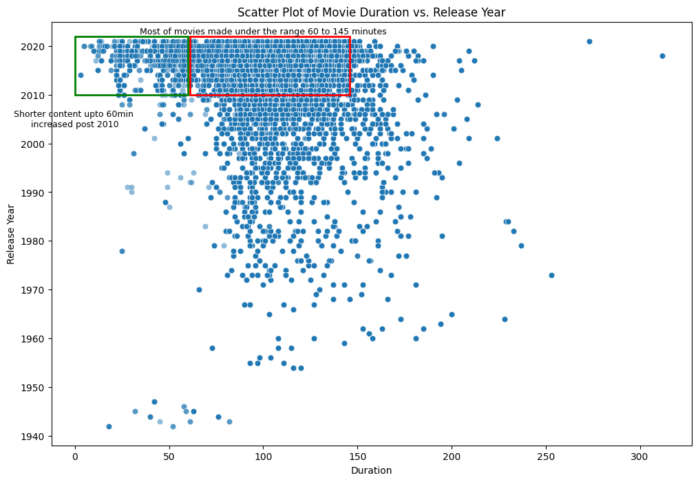
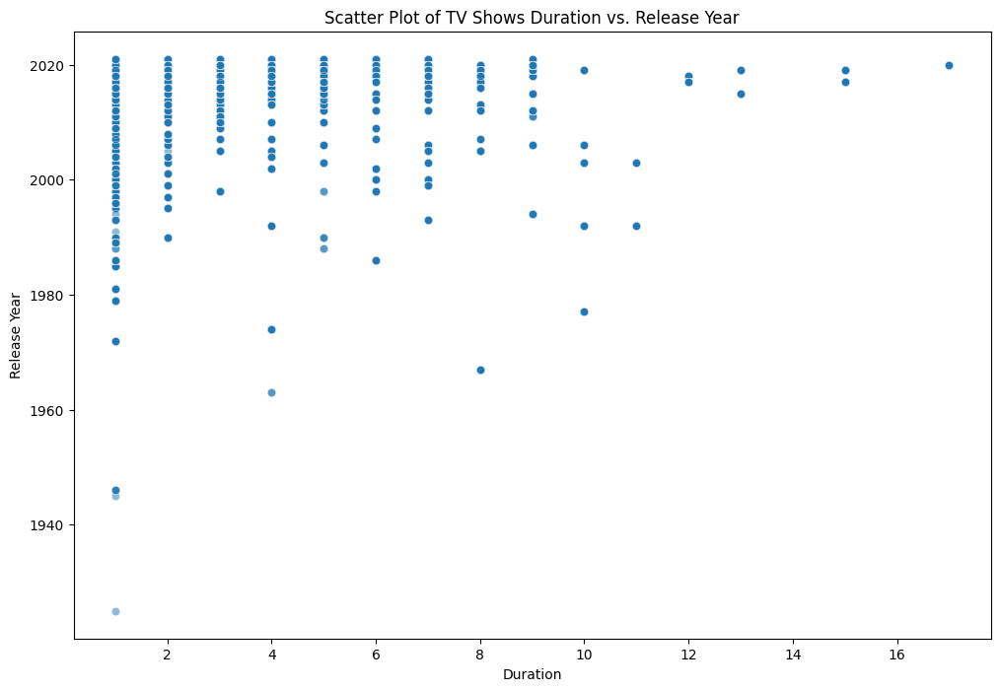

# Netflix data analysis
 analysing the data of Netflix movies/Tv shows


### Check out my medium Blog here 


### <span style="color: red;">Problem Statement </span>
- The primary objective of this project is to extract valuable insights from the available Netflix dataset. These insights should aid Netflix in making informed decisions regarding the types of movies and TV shows to produce and strategize business growth in different countries.

### cream of the project!

#####   <span style="color: navy;">Insights based on Non-Graphical and Visual Analysis</span>
- Distribution of Netflix collection in Movies is 69.6% and in TV Shows it is 30.4%
- Netflix collection of Movies spans from Year 1942 to 2021 (i.e 79 Years) and Tv shows span from Year 1925 to 2021 (i.e 96 Years)
- collection of netflix consist 8807 Titles, 36440 Actors, 4994 Directors, 42 Genre, 124 Countries and  15 Content Ratings are there.
- features by Number of Title :-
    - Top 5 Director:-
        1. Rajiv Chilaka
        2. Jan Suter
        3. Raúl Campos
        4. Marcus Raboy	
        5. Suhas Kadav
    - Top 5 Actors:-
        1. Anupam Kher
        2. Shah Rukh Khan	
        3. Julie Tejwani	
        4. Naseeruddin Shah	
        5. Takahiro Sakurai
    - Top 5 Countries:-
        1. United States	
        2. India
        3. United Kingdom	
        4. Canada
        5. France
    - Top 5 Genre:-
        1. International Movies	
        2. Dramas
        3. Comedies
        4. International TV Shows	
        5. Documentaries	
    - Top 5 Content Rating:-
        1. TV-MA	
        2. TV-14	
        3. TV-PG	
        4. R
        5. PG-13	
    - Top 5 Durations 
        1. 1 season (TV Shows)
        2. 90-100 Min (Movie)
        3. 100-110 Min (Movie)
        4. 110-120 Min (Movie)
        5. 1-5 Seasons (TV Shows)

- overall July has been observed as highest title additions of 831(9.43%) followed by december at 813(9.23%) titles added, and February with lowest number of additions at 563(6.39%)
- Friday is most popular to release shows having 2502 (28.04%) addition, while Sunday is the least popular with 752 (8.53%)  additions 
- in year 2018, 2019 and 2020 before pandamic years No. of Releasing Movies declined and No. of TV Shows Advanced, this shows TV Shows are getting more poplar recently 
- in year 2021, No. of TV Shows releasing crossed the No. of Movies released , although overall both declined due to pandemic 
- addition of Shorter Conrent accelerated since 2010, with a staggering 9.8 times compared to before 2010
- Most of Movies Movies fall under 60-145 Min duration Range
- It is observed that Netflix is More focused in Mature rated Movies / TV shows 
- rating of Anime series Genre somewhat Matches with Kids series in the collection, but Kids series is spread in 30 countries in comparison to Anime series only 10 Countries 

#####   <span style="color: navy;">Business Insights</span>

- 81.67% content is produced in top 10 countries and the rest 114 countries contribute 18.33%
- out of the 114 countries some economically powerful countries are, 
    1. China
    2. Australia
    3. Brazil
    4. Italy
    5. Russia
- Top 4 ratings contribute 79.81% content and the rest 11 rating type 20.19%
    1. TV-MA (36.41%)
    2. TV-14 (24.53%)
    3. TV-PG (9.8%)
    4. R (9.07%)
        - It is known that R rating in india has very few titles (6)
- 93.52% of the content was added in the netfix in 5 years(2017-2021) and the rest 6.48% was added in 9 years (2008 - 2017)
- Average Duration of Movies is nearly 106 Min and Tv shows is 2 seasons 
    - we can note here that 1 title count of movie = 106 Min of possible watchtime & 1 title count of TV Show = 2 season of possible watchtime 
- Top 10 Genre covers 65.77% and the rest 32 Genre covers 34.23% 
    - out of the rest 32 Genre following can be interesting to explore:-
        1. TV Comedies 
        2. Thrillers
        3. Crime TV Shows 
        4. Kids TV 
        5. Docuseries 

#####   <span style="color: navy;">Recommendation</span>

- As seen in the Business Insight, Most of the counry's content potential is yet to unflod, and many regional content is witnessed to breakthrough the popularity in recent years, so it is recommended to search for such regional content that may have the right potential to attract more users with the help of newly introduced novelty!
- it is understood that out of selective revenue models of netflix, Ad revenue is indeed an important one
    - as seen in the business insight, a movie has a possibility of 106 minutes of watch time against a Tv show of 2 seasons 
        - say 2 seasons has around 10 episodes equates to 20 episodes with each assumed duration of 40 minutes totaling to 800 minutes 
        - in a Tech platform like Netflix, Busines metrics like DAU (Daily active users), WAU (Weekly active users) & MAU (Montly active users) are crucially important to look out for, and the comparison of Movie and TV series, Tv series would increase the watchtime of users, in turn users would be more likely of renewing their subscription as well as more watchtime ensures higher Ad revenues.
- We can interpret top Genres here as widely accepted genre and content produced under such genre would have higher probability of popularity and acceptance by the audience.
- countries like Japan, Greece, Italy, Germany etc are known to have higher % of old people, Netflix can study the demographics of all countries to target the most optimal audience, in general it is undoubtedly the Adult users that is targeted but, tailoring the content based on Demographics of country might help expand the userbase.
- since pandemic, a boom in online education is seen (also known as zoom era), Netflix can tap into this demand and enable content for kids where entertaining education can help expand userbase under "Netflix for kids!"


### Contents of the project 


### initial findings

- it is intersting to note that there are as many as 1793 Tv shows that has only 1 season
- the frequency in rating suggests that TV-MA is the most rated type , it basically means Mature Audience Only
- No. of movies produced in United states (2845) are higher than other countries 
- threre seems to be a lot of Missing Director names here, the reason can be that a lot of Tv shows has different directors directig perticular episode and naming all wouldnt be possible here!(for example a Tv show called 'tales of the city' has 10 episodes and 6 directors to direct them!)
- Rajiv Chilaka is most likely a director thas has most movies/Tv shows directed in the dataset but we will confirm that in our further analysis 
- 2018 seems to be the year when most of movies/tv shows were, released, we will precisely check this in our futher analysis 
- 1st Jan 2020 seems to be the date when highet number of movies/tv shows were added, we will verify this as well in our analysis further 
- Dramas, International Movies are the most opted genere, we will narrow down further to find the top number.
- further diving into data it is found that there are movies with dubbed language as well here, for example Bhoomika , it is available in 4 different languages and there are total of 27 movies/tv shows like that and total number including all languages are 59.
- There are Two ```type``` of Entertainment options as ```Movie``` and ```TV Show```

#### unnesting of columns 

- 'director' column has certain rows where names of two or more director names are present, which clearly indicates that the perticular movie was directed by two or more directors, hence the next steps are defined to expand the dataset in a ```copy``` such that each row consist of only one director, this will enable us to identify the number of movies contributed by each unique director.
- 'country' column has certain rows where names of two or more countries are present, which clealy indicates that the perticular movie was produced in multiple countries, hence the next steps are defined to expand the dataset in a ```copy``` such that each row consist of only one country, this will enable us to identify the number of movies produced by each unique country.
- 'cast' column has certain rows where names of two or more Actor names are present, which clealy indicates that the perticular movie had two or more number of actors, hence the next steps are defined to expand the dataset in a ```copy``` such that each row consist of only one Actor, this will enable us to identify the number of movies each actors worked on.
- 'listed_in' column has certain rows where names of two or more genre are present, which clealy indicates that the perticular movie covers multiple genre, hence the next steps are defined to expand the dataset in a ```copy``` such that each row consist of only one genre, this will enable us to identify the number of movies covered under each genre.
- we could have done all 4 unnesting in a single copy, but this would not be efficient if the dataset was larger in number of rows, hence to make the approach more general for larger datasets we kept unnesting in seperate parts 
- once all the unnesting is done we merge the data using a common unique feature which in our case can be 'show_id' or 'title'

#### Null values handling

- as we can see from the results that out of 11 columns, **6 columns** (>50% of columns) contains null values, out of those 6 columns. 
    - 3 columns are **Director, Cast, rating** [ we will have to fill these with "Unknown" tag as both columns are catagorical and % of nulls is also relatively high]
    - for **'date_added'** column we will impute the values by mode of date_added to the corresponding release_year, for example if we have a null value in date_added column where release year is 2015, we will look for the mode of date_added column when the release year is 2015 and we will fill that value in date_added missing value.
    - **'duration'** ~ for this columns we will take a look at null location to see if there's any simple entry mistakes that can be corrected.
    - **'country'** ~ we will fill these nulls with modes of director and cast country in other titles and the rest of null values will be filled as 'unknown'

        ```def impute_based_on_mode(df, target_col, group_col):
        for group in df[df[target_col].isnull()][group_col].unique():
            if group in df[~df[target_col].isnull()][group_col].unique():
                mode_value = df[df[group_col] == group][target_col].mode().values[0]
                df.loc[df[group_col] == group, target_col] = df.loc[df[group_col] == group, target_col].fillna(mode_value)
        return df

        fdf= impute_based_on_mode(fdf, 'country', 'director')
        fdf= impute_based_on_mode(fdf, 'country', 'cast')```

##### finding outliers 

            def find_outliers(df, column_name):
        #Q1 (25th percentile) and Q3 (75th percentile)
        Q1 = df[column_name].quantile(0.25)
        Q3 = df[column_name].quantile(0.75)
        IQR = Q3 - Q1
        
        # lower and upper bound for outliers
        lower_bound = Q1 - 1.5 * IQR
        upper_bound = Q3 + 1.5 * IQR
        
        # Find outliers
        outliers = df[(df[column_name] < lower_bound) | (df[column_name] > upper_bound)]
        return outliers

#### Univariate Analysis 

- 

- 

- 

- 

- 

- 

- 

- 

- 

- 

- 

- 

- 

#### Bivariate Analysis 

- 

- 

- 

- 

- 

#### Pair plot

- 

#### Further data Exploration 

- 

- 

- 

- 

- 

- 

- 

- 

- 

- 

- 

- 


## Contact

If you have any feedback/are interested in collaborating, please reach out to me at [](https://www.linkedin.com/in/kartikey-vyas-2a29b9273) &nbsp; <a href="mailto:kvsvyas@gmail.com"> 


## License

[MIT](https://choosealicense.com/licenses/mit/)

